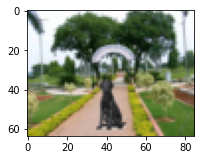
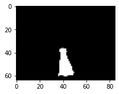
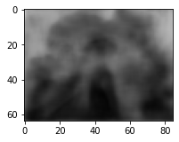
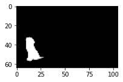
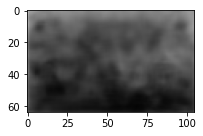
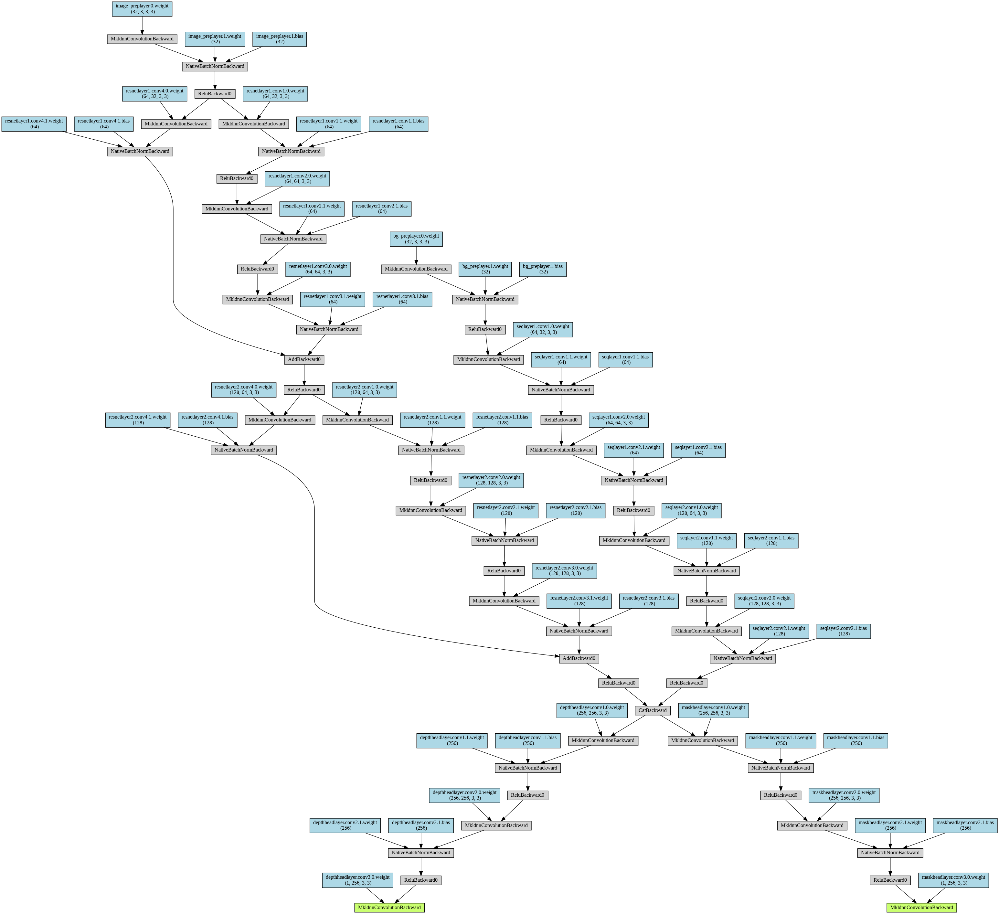

# EVA4 15 : Mask & Depthmap Prediction

#### Submitted By #### 
Deepjyoti Saha </br>
Canvas ID: deepjyoti.saha@gmail.com

## Overview
Till now, I have been playing with classification problems, which predict classes in a given image. In this exercise I have built a DNN which predicts images! This network takes two input images - an image with a foreground object & a background scene, and an image with only the background scene, and generates the mask for the foreground object in the image and a depthmap of the image. How cool is that!

### Usage
Download the final model file from the following link: 
[Predict Mask and Depthmap Model Download Link](https://drive.google.com/drive/folders/16g8vBABth6hPfzfXAwmaOWBOJfIhmCZW?usp=sharing) <br/>

```python

from utils import predict

## arguments:
## modelpath - the absolute path for model file
## filepath - the absolute path for test image files
## bg - the filename for background image
## image - the filename for image

predict.predict_images(modelpath, filepath, bg,  image)
```
[Sample Usage Code](S15_SamplePredict.ipynb)

### Results ###

|    Epocs     |  Mask Dice Score   |    Depthmap Dice Score  | 
| ---------------- | -------------- | ------------------ |
| 28 |   0.91 |  0.43 |

The following predicted images were generated with input images that network has never seen.

|    Background (Input)     |     Image (Input)    |    Predicted Mask (Output)  | Predicted Depthmap (Output) |
| ---------------- | ---------------- | -------------- | ------------------ |
|   |   |   |   |
|   |   |   |   |

## Solution

### Problem Statement
In this exercise I attempted to build DNN which takes two input images - an image with a foreground object & a background scene, and an image with only the background scene, and generates the mask for the foreground object and a depthmap of the image.

### Approach
The approach is to build a DNN using ideas from the RESNET architecture, and then design the tail to predict output images instead of labels. I have then used suitable loss functions to train the network to learn the patterns and predict the mask and depthmap images. I have used two different heads and different loss functions for the mask and depthmap prediction. 

[Solution Code](S15_Mask_and_Depthmap_Prediction.ipynb)

### Dataset 
The dataset consists of the following images sets: </br>
* Background Images: These are images of a scene, in this case a park. 
* Foreground Images: These are images of an object, in this case a dog with a transparent background.
* Foreground Mask Images:These are the mask images of the foreground image. 
* Generated Images: These are images generated by superimposing the object on the scene, i.e, the dog on the park. For each foreground and background combination, the foreground images is superimposed at 20 random positions, and again flipped superimposed at 20 random postitions. 
* Mask for Generated Images: This is the mask for generated images. 
* Depthmap Images: These are the depthmap images of the generated image, these are generated using a DepthDepth model. 

The dataset consist of 400000 images for each set.

More details on the dataset can be found here: [Session 15A - Dataset Generation](https://github.com/deepjyotisaha85/eva4/tree/master/session15A)

### Data Pipeline
The key challenge in setting up the datapipeline was the sheer volume of data. Each of the image set to be processed had 400000 image files. I built a customer Dataset class which extends the Dataset class from Pytorch and I read the files directly from the filesystem in the __getitem__. This is because the data volume was too large to be read and stored in a single shot.

Further, I converted the mask images to grayscale to further optimize, as the information contained there is monochrome. I did not intentionally convert the background and image to grayscale hoping that colour information would help down the line.

Finally I converted the images to 64 x 64 for training, as beyond that resolution I was not able to train it on Colab using the available hardware resources. The original image sizes were 220 x 220.

[Datagenerator Code](utils/dataprep.py)

### Model
The base architecture DNN is based on the RESNET architecture. The network accepts two input images - the image and the background. The network has a total of __3,199,552__ parameters. The network consists of the following layers: </br>

|    Layer     | #Input Channels    |    #Output Channels |
| ------------ | ------------------ | ------------------- |
| Image Preparation Layer (Image) | 3 |  32 | 
| Image Preparation Layer (Background) | 3 |  32 | 
| Resnet Block 1 (Image) | 32 |  64 | 
| Resnet Block 2 (Image) | 64 | 128 |
| Sequential Block 1 (Background Image) | 32 | 64 |
| Sequential Block 2 (Background Image) | 64 | 128 |
| Concatenation | 128 * 2  |  256 | |
| Mask Head | 256 |  1  |
| Depthmap Head | 256  |  1 | 

[DNN Code](model/dnn.py)

#### Model Visualizaton
The model visualization was generated using torchviz </br>

 

### Loss Function
The network has 2 different tasks to perform - predict the masks and predict the depthmaps. I have used two different loss functions for these tasks. However, on training I found that mask was getting trained more easily than the depth map, hence I decided to conider a weighted average of the two loss functions, so that I can assign weights to each. In this case, I got good results by assigning a weight of 70% to depthmap loss.

```
w1 - weightage for mask loss
w2 - weightage for depthmap loss

loss = (w1 * mask_loss) + (w2 * depthmap_loss)

```
[Custom Loss Code](utils/customloss.py)

#### Loss Function for Mask
I used BCEWithLogitsLoss for the mask prediction

#### Loss Function for Depthmap
I used a custom loss funciton for depthmap prediction. The custom loss function had 3 components, and is calculated as follows:

```
loss_pixel = Pixel wise loss
loss_edge = Edge loss
loss_ssim = Loss calculated based on Structural Similarity (SSIM)

depthmap_loss = (w1 * loss_pixel) + (w2 * loss_edge) + (w3 * loss_ssim) 

```

### Training & Evaluation 
I used DICE score for evaluation of the predicted images. I trained the network for 25 epocs.

[Dice Score Code](utils/dice.py)

### Challenges & Constrains
The size of the dataset was the biggest challenge, hence I had to train the network on images of resolution 64 x 64. The original image size is 220 x 220

## Next Steps
* Try Encoder-Decoder based Architecture
* Image Augmentation
* Code Optimization


## Reference
* Dice Score Calculation: https://github.com/milesial/Pytorch-UNet
* Gradient Calculation in Pytorch: https://discuss.pytorch.org/t/how-to-calculate-the-gradient-of-images/1407/6
* Monocular Depth Estimation: https://github.com/ialhashim/DenseDepth
* https://towardsdatascience.com/metrics-to-evaluate-your-semantic-segmentation-model-6bcb99639aa2
* SSIM: https://github.com/Po-Hsun-Su/pytorch-ssim
